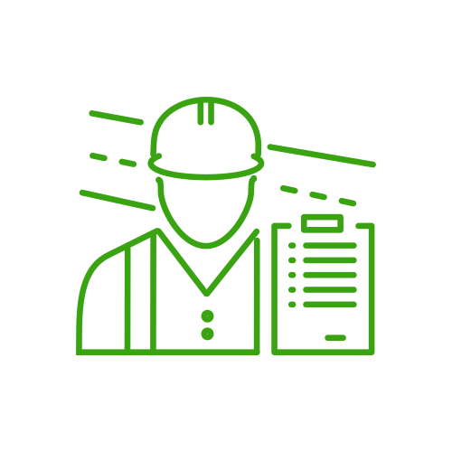
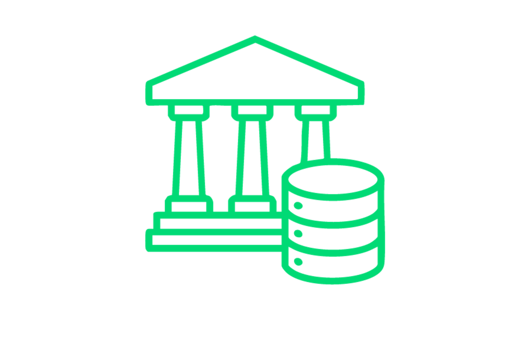

---
hide:
  - toc
---

<h1 id="voce-ainda-entrega-ou-recebe-projeto-as-cegas">¿Aún entregas o recibes proyectos a ciegas?</h1>

Brasidata trabaja para sacar a la ingeniería de la "oscuridad". Implementamos la infraestructura necesaria para que tu empresa deje de confiar ciegamente en software o procesos manuales. Garantizamos que toda la información que entra o sale sea auditada, validada y útil.

[Hable con nosotros](https://api.whatsapp.com/send/?phone=5524981796934&text=Hola%2C+vengo+del+sitio+y+quiero+saber+m%C3%A1s%21&type=phone_number&app_absent=0){ .md-button .md-button--primary }
[Planes](#pricing){ .md-button }

INGENIERÍA DE DATOS

## ¿Por qué adoptar la ingeniería de datos?

Estructuramos tus datos en estándares abiertos (OpenBIM), garantizando que tengas acceso de por vida a tus proyectos y la libertad de cambiar de herramienta cuando quieras, sin perder nunca el patrimonio digital de tu obra.

-   ### Conectividad Total de Datos
    
    Integramos tus proyectos, hojas de cálculo y sistemas de gestión en un flujo único y automático. Desde Revit hasta la obra, los datos se comunican sin errores de conversión, eliminando el trabajo manual de volver a digitar información y garantizando que la oficina y la obra hablen el mismo idioma.

-   ### Auditoría y Calidad de Entrega
    
    Asegura que todos los proyectistas y proveedores entreguen exactamente lo contratado. Nuestra auditoría automática valida cada archivo recibido, identificando errores e inconsistencias en los datos antes de que lleguen a la obra. Recibes solo información limpia, federada y lista para usar, eliminando el retrabajo de revisión manual.

-   ### Cumplimiento y Normas Técnicas
    
    Proyectos 100% alineados a la ISO 19650 (ya obligatoria en Brasil) y a las exigencias contractuales. Nuestra infraestructura valida automáticamente si cada entrega respeta los requisitos del cliente y las normas brasileñas obligatorias. Eliminas riesgos legales y técnicos, asegurando que la documentación de tu obra esté siempre organizada y en conformidad con el estándar nacional.

-   ### Inteligencia de Datos y Consulta Ágil
    
    Usa el poder de la Inteligencia Artificial para conversar con los datos de tu proyecto. En lugar de navegar por software complejo, obtienes respuestas inmediatas sobre cantidades, materiales y plazos en lenguaje natural. Transformamos tu base de datos en un asistente inteligente que facilita la toma de decisiones para quienes están en campo o en la oficina.

[¡Quiero saber más!](https://api.whatsapp.com/send/?phone=5524981796934&text=Hola%2C+vengo+del+sitio+y+quiero+saber+m%C3%A1s%21&type=phone_number&app_absent=0){ .md-button .md-button--primary }

## ¿Para quién es la Ingeniería de Datos?

-   ### Constructoras y Promotoras
    
    Para empresas que necesitan números reales para no perder dinero. Si estás cansado de presupuestos que no coinciden con la realidad y quieres tener el control total de los costos y materiales de tu obra en tiempo real, este servicio es para ti.

-   ### Oficinas de Proyectos y Coordinación
    
    Para coordinadores que pierden horas revisando archivos de terceros. Automatiza la verificación de plazos y normas técnicas, garantizando que tu equipo se enfoque en lo que realmente importa: proyectar con calidad y entregar modelos sin errores de información.

-   ### Gestores de Activos, Operación y Mantenimiento
    
    Para quienes administran el edificio una vez terminado. Facilitamos el mantenimiento y la gestión del inmueble entregando una base de datos organizada, donde encuentras cualquier manual, garantía o medida en segundos, sin tener que revolver montones de papel.

-   ### Organismos Públicos y Grandes Contratistas
    
    Para quienes necesitan garantizar la transparencia y el cumplimiento de leyes, regulaciones y normas (ej. ISO 19650). Ten la seguridad jurídica de que todos los datos del proyecto están auditados, versionados y protegidos en una infraestructura que pertenece a tu institución, y no al proveedor.

[¡Es para mí!](https://api.whatsapp.com/send/?phone=5524981796934&text=Hola%2C+vengo+del+sitio+y+quiero+saber+m%C3%A1s%21&type=phone_number&app_absent=0){ .md-button .md-button--primary }

PLANES

<h2>Elige el plan ideal</h2>

<ul>
  <li>
    <h3 class="bd-accent">Plan R1</h3>
    
Este plan se enfoca en auditoría, saneamiento y cumplimiento de activos digitales, funcionando como un filtro de calidad para datos recibidos de terceros.

    

      <input class="bd-price-toggle__input" type="checkbox" id="pricing-r1-currency-es" aria-label="Alternar moneda entre EUR y USD">
      

        199.99 €
        $ 219,99
        /mes
      

      <label class="bd-price-toggle" for="pricing-r1-currency-es">
        €
        
        $
      </label>
    

    <ul>
      <li><b>Recepción y Auditoría Automatizada:</b> Canal online para la carga de archivos IFC, con auditorías automáticas basadas en IDS para verificar el cumplimiento del plan de ejecución (BEP)</li>
      <li><b>Informes de Inconformidad:</b> Emisión de informes técnicos de fácil lectura señalando fallas en la información, permitiendo que el modelo sea devuelto para su corrección</li>
      <li><b>Fusión y Consolidación de Modelos:</b> Tras la validación, los modelos parciales se unen (federan) en un único archivo limpio y estructurado</li>
      <li><b>Normalización de Datos Periféricos:</b> Procesamiento y organización de información no estructurada proveniente de PDFs, Excel o WhatsApp, conectándola al contexto técnico del proyecto</li>
      <li><b>Extracción MVD (Model View Definition):</b> Preparación de recortes de datos específicos y validados para entregas finales o presupuestos</li>
    </ul>

    

      <a href="https://api.whatsapp.com/send/?phone=5524981796934&text=Hola%2C+quiero+el+Plan+R1&type=phone_number&app_absent=0" class="md-button md-button--primary">Quiero este plan</a>
    

  </li>

  <li class="bd-pricing__card--featured">
    <h3 class="bd-accent">Plan R5</h3>
    
Enfocado en productividad e inteligencia de negocios, este plan actúa como el departamento de ingeniería de datos del cliente.

    

      <input class="bd-price-toggle__input" type="checkbox" id="pricing-r5-currency-es" aria-label="Alternar moneda entre BRL y EUR">
      

        899.99 €
        $ 979,99
        /mes
      

      <label class="bd-price-toggle" for="pricing-r5-currency-es">
        €
        
        $
      </label>
    

    <ul>
      <li><b>Toda la Infraestructura del Plan R1:</b> Contempla todas las funcionalidades de auditoría, limpieza y fusión del plan básico</li>
      <li><b>Integración Nativa Revit:</b> Integración y manipulación directa con los archivos propietarios (.rvt) en su origen</li>
      <li><b>Automatización de Documentación (Emisión de Planos):</b> Creación de scripts para generar automáticamente vistas, planos y tablas, manteniendo los archivos en PDF y DWG siempre actualizados con el modelo 3D</li>
      <li><b>Capa de IA Generativa (LLM):</b> Una interfaz de lenguaje natural para "conversar" con los datos del proyecto, permitiendo extraer rápidamente cantidades o cruzar textos de memorias descriptivas con los modelos</li>
      <li><b>Dashboards de Cantidades en Tiempo Real:</b> Pantallas dinámicas que muestran volúmenes, costos y áreas basados en los modelos validados, cambiando las estimaciones por hechos</li>
      <li><b>Versionado y Auditoría Histórica (Data Warehouse):</b> Una base de datos que guarda el historial del proyecto, permitiendo rastrear exactamente qué se cambió entre cada revisión y los impactos de costo de esos cambios</li>
    </ul>

    

      <a href="https://api.whatsapp.com/send/?phone=5524981796934&text=Hola%2C+quiero+el+Plan+R5&type=phone_number&app_absent=0" class="md-button md-button--primary">Quiero este plan</a>
    

  </li>

  <li>
    <h3 class="bd-accent">Plan RX</h3>
    
Dirigido a proyectos de alta complejidad, investigación aplicada e implementación de ecosistemas OpenBIM, destinado a empresas que necesitan una integración a gran escala o una arquitectura de datos personalizada.

    <ul>
      <li><b style="color: #00c853; display: inline-block;">No es una extensión del Plan R5:</b> Sus elementos pueden personalizarse y contratarse por separado.</li>
      <li><b>Desarrollo de Ontologías Propias:</b> Modelado de grafos de conocimiento y de ontologías específicas enfocadas en el dominio del cliente, basándose en las directrices de la ISO 21597 y la Web Semántica.</li>
      <li><b>Implementación de CDE (Common Data Environment) Personalizado:</b> Creación de una arquitectura para entornos de datos en la nube garantizando alta conformidad y seguridad, siguiendo estándares similares a los exigidos en infraestructuras críticas</li>
      <li><b>Capacitación:</b> Formación de los equipos internos del cliente para que puedan operar dentro de los estándares de OpenBIM y mantener flujos de trabajo determinísticos.</li>
      <li><b>Investigación y Desarrollo (I+D):</b> Aplicación de estándares emergentes en la industria (como IFC5) y de automatizaciones de ingeniería específicas para resolver problemas complejos vinculados a la gestión de activos e interoperabilidad de datos.</li>
    </ul>

    

      <a href="https://api.whatsapp.com/send/?phone=5524981796934&text=Hola%2C+quiero+el+Plan+RX&type=phone_number&app_absent=0" class="md-button md-button--primary">Quiero este plan</a>
    

  </li>
</ul>

## Preguntas Frecuentes

¿Qué es la Ingeniería de Datos en la construcción civil?

Es el servicio que organiza, limpia y conecta toda la información de tu obra (proyectos, hojas de cálculo y sistemas) para que tengas números confiables y automatización real, sin depender de revisión manual.

Ya uso BIM y Revit. ¿Por qué necesito a Brasidata?

El BIM modela, pero Brasidata garantiza que el dato dentro de ese modelo sea correcto, esté auditado e integrado a tus otros sistemas (como el financiero y el ERP), evitando que tu BIM sea solo una maqueta 3D bonita.

¿Cómo garantizan que los proyectistas entreguen lo que contraté?

A través de nuestro servicio de auditoría, validamos automáticamente cada archivo recibido contra las normas técnicas y las exigencias de tu contrato. Si hay un error, el sistema señala al instante el problema y al responsable.

¿Qué cambia con la ISO 19650 en mi empresa?

La ISO 19650 ahora es el estándar nacional obligatorio en Brasil. Adecuamos toda tu estructura de datos para que estés en conformidad con ella, garantizando seguridad jurídica y organización profesional de la información.

¿Quedaré "atrapado" a algún software específico?

No. Uno de nuestros pilares es la <b>Soberanía Digital</b>. Usamos estándares abiertos (OpenBIM) para que los datos pertenezcan a tu empresa, permitiéndote acceder a tu información para siempre, independientemente del software que uses en el futuro.

¿Cómo ayuda la Inteligencia Artificial en mi obra?

En nuestro plan avanzado, puedes "conversar" con los datos de tu proyecto. En lugar de buscar en modelos complejos, preguntas por chat el volumen de un material o el estado de una etapa y obtienes la respuesta inmediata.

¿Realizan la emisión de planos y documentos?

Sí. En el plan avanzado, automatizamos la generación de hojas y tablas directamente de los modelos validados, lo que elimina errores de digitación y garantiza que el plano en obra refleje exactamente lo proyectado.

¿Se puede integrar la información de WhatsApp y hojas de cálculo al proyecto?

Sí. Nuestro sistema es capaz de organizar datos provenientes de fuentes informales, vinculando conversaciones, documentos y tablas al contexto técnico de la obra para que nada se pierda.

¿Necesito contratar un equipo de TI para usar Brasidata?

No. Funcionamos como tu departamento de ingeniería de datos. Entregamos la infraestructura lista y los informes procesados para que tu equipo técnico se enfoque solo en la ejecución y gestión de la obra.

## ¡Tus datos en el lugar correcto!

Libera a tu empresa de la "trampa de la herramienta" y de la dependencia de proveedores únicos de software cerrado.

[Saber más](https://api.whatsapp.com/send/?phone=5524981796934&text=Hola%2C+vengo+del+sitio+y+quiero+saber+m%C3%A1s%21&type=phone_number&app_absent=0){ .md-button .md-button--primary }

