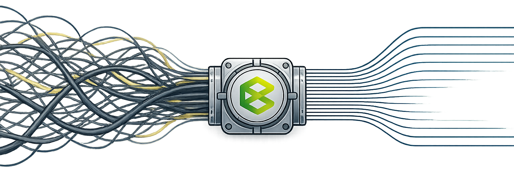

---
hide:
  - toc
---

<h1 id="voce-ainda-entrega-ou-recebe-projeto-as-cegas">Você ainda entrega ou recebe projeto às cegas?</h1>

A Brasidata atua para tirar a engenharia da "escuridão". Implementamos a infraestrutura necessária para que sua empresa deixe de confiar cegamente em softwares ou processos manuais. Garantimos que toda informação que entra ou sai seja auditada, validada e útil.

[Fale conosco](https://api.whatsapp.com/send/?phone=5524981796934&text=Ol%C3%A1%2C+vim+do+site+e+quero+saber+mais%21&type=phone_number&app_absent=0){ .md-button .md-button--primary }
[Pricing](#pricing){ .md-button }

ENGENHARIA DE DADOS

## Por que adotar a engenharia de dados?

Estruturamos seus dados em padrões abertos (OpenBIM), garantindo que você tenha acesso vitalício aos seus projetos e a liberdade de trocar de ferramenta sempre que quiser, sem nunca perder o patrimônio digital da sua obra.

-   ### Conectividade Total de Dados
    
    Integramos seus projetos, planilhas e sistemas de gestão em um fluxo único e automático. Do Revit ao canteiro, os dados conversam entre si sem erros de conversão, eliminando o trabalho manual de redigitar informações e garantindo que o escritório e a obra falem a mesma língua.

-   ### Auditoria e Qualidade de Entrega
    
    Garanta que todos os projetistas e fornecedores entreguem exatamente o que foi contratado. Nossa auditoria automática valida cada arquivo recebido, identificando erros e inconsistências no dado antes que eles cheguem à obra. Você recebe apenas informações limpas, federadas e prontas para o uso, eliminando o retrabalho de conferência manual.

-   ### Conformidade e Normas Técnicas
    Projetos 100% alinhados à ISO 19650 (já obrigatória no Brasil) e às exigências contratuais. Nossa infraestrutura valida automaticamente se cada entrega respeita os requisitos do cliente e as normas brasileiras obrigatórias. Você elimina riscos jurídicos e técnicos, assegurando que a documentação da sua obra esteja sempre organizada e em conformidade com o padrão nacional.

-   ### Inteligência de Dados e Consulta Ágil
    
    Use o poder da Inteligência Artificial para conversar com os dados do seu projeto. Em vez de navegar em softwares complexos, você obtém respostas imediatas sobre quantitativos, materiais e prazos em linguagem natural. Transformamos o seu banco de dados em um assistente inteligente que facilita a tomada de decisão para quem está no campo ou no escritório.

[Quero saber mais!](https://api.whatsapp.com/send/?phone=5524981796934&text=Ol%C3%A1%2C+vim+do+site+e+quero+saber+mais%21&type=phone_number&app_absent=0){ .md-button .md-button--primary }

## Engenharia de Dados é para quem?

-   ### Construtoras e Incorporadoras
    Para empresas que precisam de números reais para não perder dinheiro. Se você está cansado de orçamentos que não batem com a realidade e quer ter o controle total dos custos e materiais da sua obra em tempo real, este serviço é para você.

-   ### Escritórios de Projetos e Coordenação
    Para coordenadores que perdem horas conferindo arquivos de terceiros. Automatize a verificação de prazos e normas técnicas, garantindo que sua equipe foque no que realmente importa: projetar com qualidade e entregar modelos sem erros de informação.

-   ### Gestores de Ativos e Operação
    Para quem administra o edifício depois de pronto. Facilitamos a manutenção e a gestão do imóvel entregando um banco de dados organizado, onde você encontra qualquer manual, garantia ou medida em segundos, sem precisar revirar pilhas de papel.

-   ### Órgãos Públicos e Grandes Contratantes
    Para quem precisa garantir a transparência e a conformidade com leis, regulações e normas (e.g. ISO 19650). Tenha a segurança jurídica de que todos os dados do projeto estão auditados, versionados e protegidos em uma infraestrutura que pertence à sua instituição, e não ao fornecedor.

## Perguntas Frequentes

O que é Engenharia de Dados na construção civil?

É o serviço que organiza, limpa e conecta todas as informações da sua obra (projetos, planilhas e sistemas) para que você tenha números confiáveis e automação real, sem depender de conferência manual.

Eu já uso BIM e Revit. Por que preciso da Brasidata?

O BIM modela, mas a Brasidata garante que o dado dentro desse modelo esteja correto, auditado e integrado aos seus outros sistemas (como o financeiro e o ERP), evitando que o seu BIM seja apenas uma maquete 3D bonita.

Como vocês garantem que os projetistas entreguem o que eu contratei?

Por meio do nosso serviço de auditoria, validamos automaticamente cada arquivo recebido contra as normas técnicas e as exigências do seu contrato. Se houver erro, o sistema aponta na hora o problema e o responsável.

O que muda com a ISO 19650 na minha empresa?

A ISO 19650 agora é o padrão nacional obrigatório. Nós adequamos toda a sua estrutura de dados para que você esteja em conformidade com ela, garantindo segurança jurídica e organização profissional da informação.

Vou ficar "preso" a algum software específico?

Não. Um dos nossos pilares é a <b>Soberania Digital</b>. Usamos padrões abertos (OpenBIM) para que os dados pertençam à sua empresa, permitindo que você acesse suas informações para sempre, independente de qual software usar no futuro.

Como a Inteligência Artificial ajuda na minha obra?

No nosso plano avançado, você pode "conversar" com os dados do seu projeto. Em vez de procurar em modelos complexos, você pergunta por chat o volume de um material ou o status de uma etapa e obtém a resposta imediata.

Vocês fazem a emissão de pranchas e documentos?

Sim. No plano avançado, automatizamos a geração de folhas e tabelas diretamente dos modelos validados, o que elimina erros de digitação e garante que a prancha no canteiro reflita exatamente o que foi projetado.

Dá para integrar as informações do WhatsApp e planilhas ao projeto?

Sim. Nosso sistema é capaz de organizar dados vindos de fontes informais, vinculando conversas, documentos e tabelas ao contexto técnico da obra para que nada se perca.

Preciso contratar uma equipe de TI para usar a Brasidata?

Não. Nós funcionamos como o seu departamento de engenharia de dados. Entregamos a infraestrutura pronta e os relatórios mastigados para que sua equipe técnica foque apenas na execução e gestão da obra.

## Somos a Brasidata!

### Sua Parceira em Soluções de Software e Consultoria BIM

-   ### Missão
    Capacitar empresas e profissionais para a transformação digital na construção civil, oferecendo treinamento, consultoria e modelagem BIM, para elevar a eficiência e a qualidade dos projetos.

-   ### Visão
    Ser referência em ensino e consultoria BIM no Brasil, promovendo a adoção da metodologia BIM em empresas privadas e no setor público, impulsionando a inovação e a produtividade na construção civil.

-   ### Valores
    Valorizamos a capacitação como base para a transformação digital na construção civil, unindo inovação e excelência técnica para otimizar processos. Defendemos a sustentabilidade, reduzindo desperdícios por meio da digitalização, e mantemos um forte compromisso com o setor público, promovendo transparência e eficiência em obras governamentais.

[Entre em Contato](https://api.whatsapp.com/send/?phone=5524981796934&text=Ol%C3%A1%2C+vim+do+site+e+quero+saber+mais%21&type=phone_number&app_absent=0){ .md-button .md-button--primary }

{ .bd-wide-img }

## Dúvidas sobre BIM? Estamos aqui para ajudar!

A implementação do BIM pode transformar seus projetos, reduzindo custos, otimizando processos e aumentando a eficiência. Nossa equipe está pronta para esclarecer suas dúvidas e oferecer a melhor solução para sua empresa.

[Entre em Contato](https://api.whatsapp.com/send/?phone=5524981796934&text=Ol%C3%A1%2C+vim+do+site+e+quero+saber+mais%21&type=phone_number&app_absent=0){ .md-button .md-button--primary }

## Empresa

**Telefone:** +55 (24) 98136-0027  
**Endereço:** Rua Senador Dantas, 117, Centro, Rio de Janeiro, RJ - CEP 20031-911  
**Email:** contato@brasidata.com.br

<a class="bd-wa-float" href="https://api.whatsapp.com/send/?phone=5524981796934&text=Ol%C3%A1%2C+vim+do+site+e+quero+saber+mais%21&type=phone_number&app_absent=0" aria-label="WhatsApp" target="_blank" rel="noopener">
<svg viewBox="0 0 32 32" aria-hidden="true"><path fill="currentColor" d="M19.11 17.46c-.27-.14-1.6-.79-1.85-.88-.25-.09-.43-.14-.61.14-.18.27-.7.88-.86 1.06-.16.18-.32.2-.59.07-.27-.14-1.15-.42-2.18-1.35-.81-.72-1.35-1.61-1.51-1.88-.16-.27-.02-.41.12-.55.12-.12.27-.32.41-.48.14-.16.18-.27.27-.45.09-.18.05-.34-.02-.48-.07-.14-.61-1.47-.84-2.02-.22-.52-.44-.45-.61-.46l-.52-.01c-.18 0-.48.07-.73.34-.25.27-.95.93-.95 2.27 0 1.34.98 2.64 1.12 2.82.14.18 1.93 2.95 4.68 4.13.66.28 1.17.45 1.57.58.66.21 1.26.18 1.74.11.53-.08 1.6-.65 1.83-1.27.23-.61.23-1.14.16-1.27-.07-.13-.25-.2-.52-.34zM16 3C8.83 3 3 8.67 3 15.66c0 2.23.6 4.41 1.74 6.32L3 29l7.2-1.88c1.84 1 3.92 1.53 6.03 1.54h.01c7.17 0 13-5.67 13-12.66C29.24 8.67 23.17 3 16 3zm0 23.44h-.01c-1.9-.01-3.76-.52-5.38-1.49l-.39-.23-4.27 1.12 1.14-4.05-.25-.4a10.26 10.26 0 0 1-1.6-5.55C5.24 9.91 10.1 5.6 16 5.6c5.9 0 10.76 4.31 10.76 10.06 0 5.75-4.86 10.06-10.76 10.06z"/></svg>
</a>

