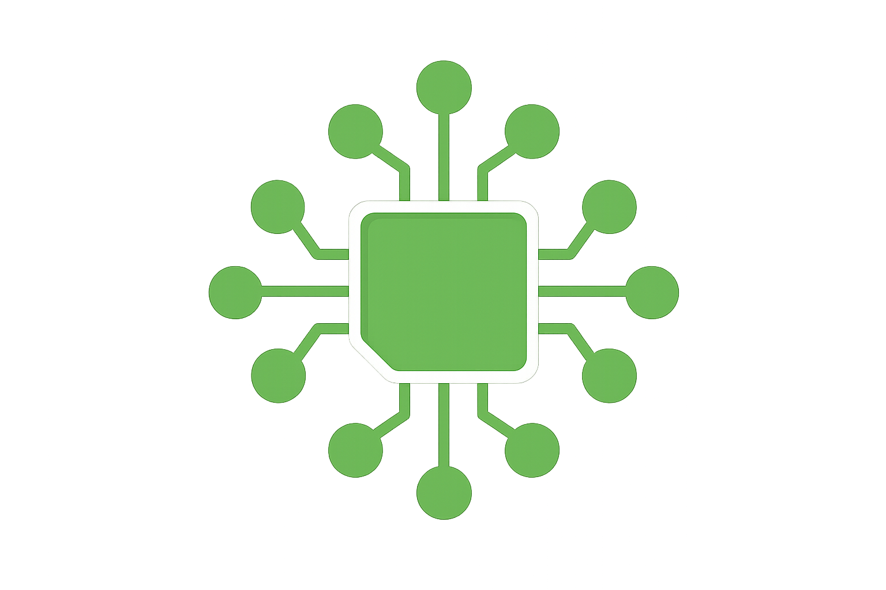
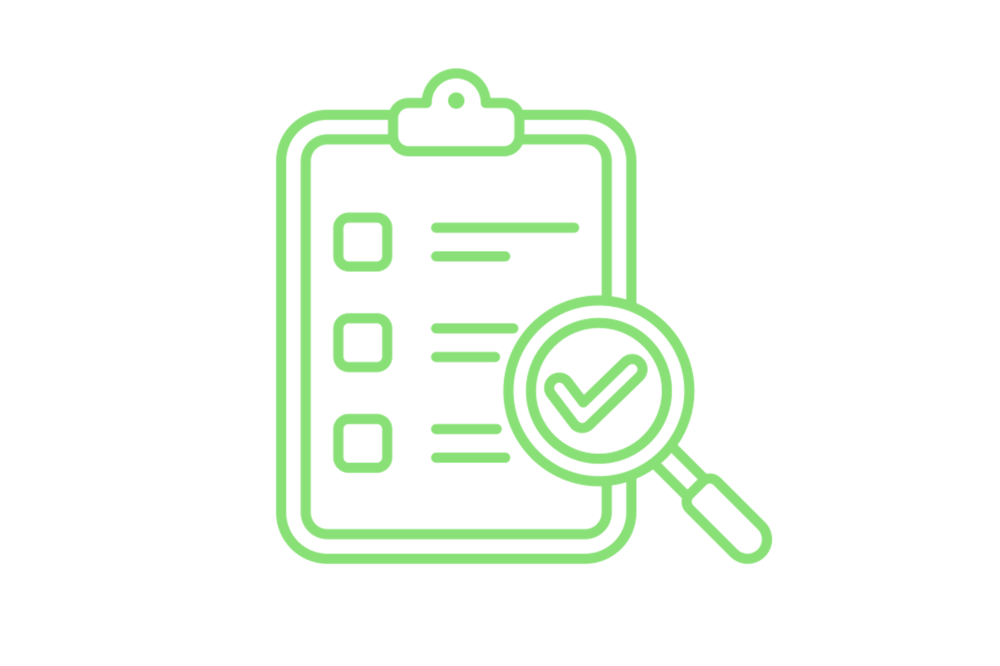
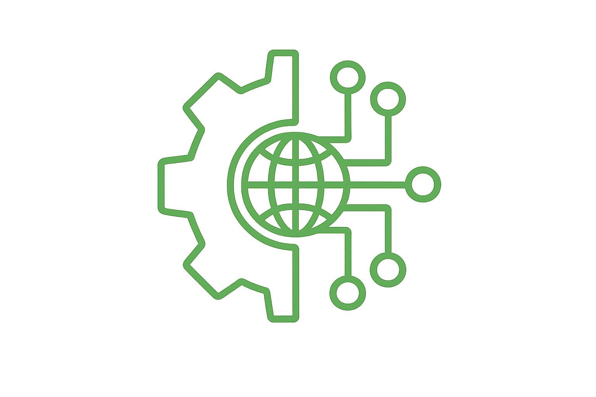
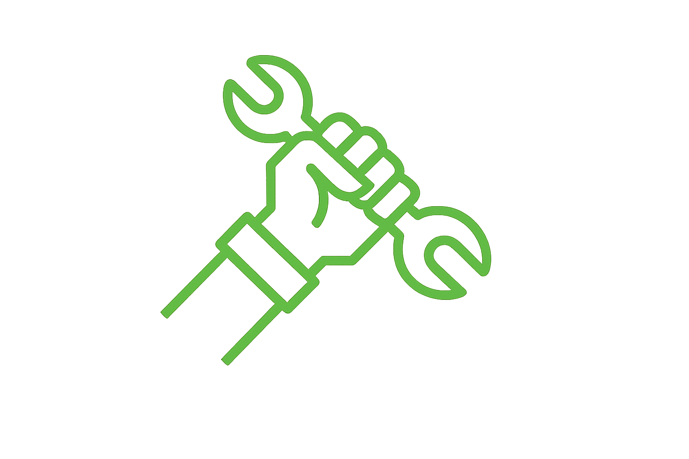

---
hide:
  - toc
---

<h1 id="voce-ainda-entrega-ou-recebe-projeto-as-cegas">Você ainda entrega ou recebe projeto às cegas?</h1>

A Brasidata atua para tirar a engenharia da "escuridão". Implementamos a infraestrutura necessária para que sua empresa deixe de confiar cegamente em softwares ou processos manuais. Garantimos que toda informação que entra ou sai seja auditada, validada e útil.

[Fale conosco](https://api.whatsapp.com/send/?phone=5524981796934&text=Ol%C3%A1%2C+vim+do+site+e+quero+saber+mais%21&type=phone_number&app_absent=0){ .md-button .md-button--primary }
[Planos](#pricing){ .md-button }

ENGENHARIA DE DADOS

## Por que adotar a engenharia de dados?

Estruturamos seus dados em padrões abertos (OpenBIM), garantindo que você tenha acesso vitalício aos seus projetos e a liberdade de trocar de ferramenta sempre que quiser, sem nunca perder o patrimônio digital da sua obra.

-   ### Conectividade Total de Dados
    
    Integramos seus projetos, planilhas e sistemas de gestão em um fluxo único e automático. Do Revit ao canteiro, os dados conversam entre si sem erros de conversão, eliminando o trabalho manual de redigitar informações e garantindo que o escritório e a obra falem a mesma língua.

-   ### Auditoria e Qualidade de Entrega
    
    Garanta que todos os projetistas e fornecedores entreguem exatamente o que foi contratado. Nossa auditoria automática valida cada arquivo recebido, identificando erros e inconsistências no dado antes que eles cheguem à obra. Você recebe apenas informações limpas, federadas e prontas para o uso, eliminando o retrabalho de conferência manual.

-   ### Conformidade e Normas Técnicas
    
    Projetos 100% alinhados à ISO 19650 (já obrigatória no Brasil) e às exigências contratuais. Nossa infraestrutura valida automaticamente se cada entrega respeita os requisitos do cliente e as normas brasileiras obrigatórias. Você elimina riscos jurídicos e técnicos, assegurando que a documentação da sua obra esteja sempre organizada e em conformidade com o padrão nacional.

-   ### Inteligência de Dados e Consulta Ágil
    
    Use o poder da Inteligência Artificial para conversar com os dados do seu projeto. Em vez de navegar em softwares complexos, você obtém respostas imediatas sobre quantitativos, materiais e prazos em linguagem natural. Transformamos o seu banco de dados em um assistente inteligente que facilita a tomada de decisão para quem está no campo ou no escritório.

[Quero saber mais!](https://api.whatsapp.com/send/?phone=5524981796934&text=Ol%C3%A1%2C+vim+do+site+e+quero+saber+mais%21&type=phone_number&app_absent=0){ .md-button .md-button--primary }

## Engenharia de Dados é para quem?

-   ### Construtoras e Incorporadoras
    
    Para empresas que precisam de números reais para não perder dinheiro. Se você está cansado de orçamentos que não batem com a realidade e quer ter o controle total dos custos e materiais da sua obra em tempo real, este serviço é para você.

-   ### Escritórios de Projetos e Coordenação
    Para coordenadores que perdem horas conferindo arquivos de terceiros. Automatize a verificação de prazos e normas técnicas, garantindo que sua equipe foque no que realmente importa: projetar com qualidade e entregar modelos sem erros de informação.

-   ### Gestores de Ativos e Operação
    
    Para quem administra o edifício depois de pronto. Facilitamos a manutenção e a gestão do imóvel entregando um banco de dados organizado, onde você encontra qualquer manual, garantia ou medida em segundos, sem precisar revirar pilhas de papel.

-   ### Órgãos Públicos e Grandes Contratantes
    Para quem precisa garantir a transparência e a conformidade com leis, regulações e normas (e.g. ISO 19650). Tenha a segurança jurídica de que todos os dados do projeto estão auditados, versionados e protegidos em uma infraestrutura que pertence à sua instituição, e não ao fornecedor.

[É para mim!](https://api.whatsapp.com/send/?phone=5524981796934&text=Ol%C3%A1%2C+vim+do+site+e+quero+saber+mais%21&type=phone_number&app_absent=0){ .md-button .md-button--primary }

PLANOS

<h2>Escolha o plano ideal</h2>

<ul>
  <li>
    <h3 class="bd-accent">Plano R1</h3>
    
Este plano é focado em auditoria, saneamento e conformidade de ativos digitais, funcionando como um filtro de qualidade para dados recebidos de terceiros.

    

      <input class="bd-price-toggle__input" type="checkbox" id="pricing-r1-currency" aria-label="Alternar moeda entre BRL e EUR">
      

        R$ 1324,99
        199.99 €
        /mês
      

      <label class="bd-price-toggle" for="pricing-r1-currency">
        R$
        
        €
      </label>
    

    <ul>
      <li><b>Recebimento e Auditoria Automatizada:</b> Canal online para upload de arquivos IFC, com auditorias automáticas baseadas em IDS para checar a conformidade com o plano de execução (BEP)</li>
      <li><b>Relatórios de Inconformidade:</b> Emissão de relatórios técnicos de fácil leitura apontando falhas na informação, permitindo que o modelo seja devolvido para correção</li>
      <li><b>Merge e Consolidação de Modelos:</b> Após a validação, os modelos parciais são unidos (federados) em um único arquivo limpo e estruturado</li>
      <li><b>Normalização de Dados Periféricos:</b> Processamento e organização de informações não estruturadas vindas de PDFs, Excel ou WhatsApp, conectando-as ao contexto técnico do projeto</li>
      <li><b>Extração MVD (Model View Definition):</b> Preparação de recortes de dados específicos e validados para entregas finais ou orçamentos</li>
    </ul>

    

      <a href="https://api.whatsapp.com/send/?phone=5524981796934&text=Ol%C3%A1%2C+quero+o+Plano+R1&type=phone_number&app_absent=0" class="md-button md-button--primary">Quero este plano</a>
    

  </li>

  <li class="bd-pricing__card--featured">
    <h3 class="bd-accent">Plano R5</h3>
    
Focado em produtividade e inteligência de negócios, este plano atua como o departamento de engenharia de dados do cliente.

    

      <input class="bd-price-toggle__input" type="checkbox" id="pricing-r5-currency" aria-label="Alternar moeda entre BRL e EUR">
      

        R$ 5.627,99
        899.99 €
        /mês
      

      <label class="bd-price-toggle" for="pricing-r5-currency">
        R$
        
        €
      </label>
    

    <ul>
      <li><b>Toda a Infraestrutura do Plano R5:</b> Toda a Infraestrutura do Plano R1: Contempla todas as funcionalidades de auditoria, limpeza e merge do plano básico</li>
      <li><b>Integração Nativa Revit:</b> Integração e manipulação direta com os arquivos proprietários (.rvt) em sua origem</li>
      <li><b>Automação de Documentação (Emissão de Pranchas):</b> Criação de scripts para gerar automaticamente vistas, folhas e tabelas, mantendo os arquivos em PDF e DWG sempre atualizados com o modelo 3D</li>
      <li><b>Camada de IA Generativa (LLM):</b> Uma interface de linguagem natural para "conversar" com os dados do projeto, permitindo extrair rapidamente quantitativos ou cruzar textos de memoriais descritivos com os modelos</li>
      <li><b>Dashboards de Quantitativos Real-Time:</b> Telas dinâmicas que exibem volumes, custos e áreas baseados nos modelos validados, trocando as estimativas por fatos</li>
      <li><b>Versionamento e Auditoria Histórica (Data Warehouse):</b> Um banco de dados que guarda o histórico do projeto, permitindo rastrear exatamente o que foi alterado entre cada revisão e os impactos de custo dessas mudanças</li>
    </ul>

    

      <a href="https://api.whatsapp.com/send/?phone=5524981796934&text=Ol%C3%A1%2C+quero+o+Plano+R5&type=phone_number&app_absent=0" class="md-button md-button--primary">Quero este plano</a>
    

  </li>

  <li>
    <h3 class="bd-accent">Plano RX</h3>
    
Voltado para projetos de alta complexidade, pesquisa aplicada e implementação de ecossistemas OpenBIM, sendo destinado a empresas que precisam de uma integração de larga escala ou de uma arquitetura de dados personalizada. <b style="color: #00c853; display: inline-block;">Não é uma extensão do Plano R5</b> e seus itens podem ser contratados separadamente.

    <ul>
      <li><b>Desenvolvimento de Ontologias Próprias:</b> Modelagem de grafos de conhecimento e de ontologias específicas voltadas para o domínio do cliente, baseando-se nas diretrizes da ISO 21597 e na Web Semântica.</li>
      <li><b>Implementação de CDE (Common Data Environment) Customizado:</b> Criação de uma arquitetura para ambientes de dados em nuvem garantindo alta conformidade e segurança, seguindo padrões similares aos exigidos em infraestruturas críticas</li>
      <li><b>Treinamento:</b> Capacitação das equipes internas do cliente para que consigam operar dentro dos padrões do OpenBIM e manter fluxos de trabalho determinísticos.</li>
      <li><b>Pesquisa e Desenvolvimento (P&D):</b> Aplicação de padrões emergentes na indústria (como o IFC5) e de automações de engenharia específicas para resolver problemas complexos ligados à gestão de ativos e interoperabilidade de dados.</li>
    </ul>

    

      <a href="https://api.whatsapp.com/send/?phone=5524981796934&text=Ol%C3%A1%2C+quero+o+Plano+RX&type=phone_number&app_absent=0" class="md-button md-button--primary">Quero este plano</a>
    

  </li>
</ul>

## Perguntas Frequentes

O que é Engenharia de Dados na construção civil?

É o serviço que organiza, limpa e conecta todas as informações da sua obra (projetos, planilhas e sistemas) para que você tenha números confiáveis e automação real, sem depender de conferência manual.

Eu já uso BIM e Revit. Por que preciso da Brasidata?

O BIM modela, mas a Brasidata garante que o dado dentro desse modelo esteja correto, auditado e integrado aos seus outros sistemas (como o financeiro e o ERP), evitando que o seu BIM seja apenas uma maquete 3D bonita.

Como vocês garantem que os projetistas entreguem o que eu contratei?

Por meio do nosso serviço de auditoria, validamos automaticamente cada arquivo recebido contra as normas técnicas e as exigências do seu contrato. Se houver erro, o sistema aponta na hora o problema e o responsável.

O que muda com a ISO 19650 na minha empresa?

A ISO 19650 agora é o padrão nacional obrigatório. Nós adequamos toda a sua estrutura de dados para que você esteja em conformidade com ela, garantindo segurança jurídica e organização profissional da informação.

Vou ficar "preso" a algum software específico?

Não. Um dos nossos pilares é a <b>Soberania Digital</b>. Usamos padrões abertos (OpenBIM) para que os dados pertençam à sua empresa, permitindo que você acesse suas informações para sempre, independente de qual software usar no futuro.

Como a Inteligência Artificial ajuda na minha obra?

No nosso plano avançado, você pode "conversar" com os dados do seu projeto. Em vez de procurar em modelos complexos, você pergunta por chat o volume de um material ou o status de uma etapa e obtém a resposta imediata.

Vocês fazem a emissão de pranchas e documentos?

Sim. No plano avançado, automatizamos a geração de folhas e tabelas diretamente dos modelos validados, o que elimina erros de digitação e garante que a prancha no canteiro reflita exatamente o que foi projetado.

Dá para integrar as informações do WhatsApp e planilhas ao projeto?

Sim. Nosso sistema é capaz de organizar dados vindos de fontes informais, vinculando conversas, documentos e tabelas ao contexto técnico da obra para que nada se perca.

Preciso contratar uma equipe de TI para usar a Brasidata?

Não. Nós funcionamos como o seu departamento de engenharia de dados. Entregamos a infraestrutura pronta e os relatórios mastigados para que sua equipe técnica foque apenas na execução e gestão da obra.

## Seus dados no lugar certo!

Liberte sua empresa da "armadilha da ferramenta" e da dependência de fornecedores únicos de softwares fechados.

[Saber mais](https://api.whatsapp.com/send/?phone=5524981796934&text=Ol%C3%A1%2C+vim+do+site+e+quero+saber+mais%21&type=phone_number&app_absent=0){ .md-button .md-button--primary }

<a class="bd-footer__icon" href="https://api.whatsapp.com/send/?phone=5524981796934&text=Ol%C3%A1%2C+vim+do+site+e+quero+saber+mais%21&type=phone_number&app_absent=0" aria-label="WhatsApp" target="_blank" rel="noopener">
<svg viewBox="0 0 32 32" aria-hidden="true"><path fill="currentColor" d="M19.11 17.46c-.27-.14-1.6-.79-1.85-.88-.25-.09-.43-.14-.61.14-.18.27-.7.88-.86 1.06-.16.18-.32.2-.59.07-.27-.14-1.15-.42-2.18-1.35-.81-.72-1.35-1.61-1.51-1.88-.16-.27-.02-.41.12-.55.12-.12.27-.32.41-.48.14-.16.18-.27.27-.45.09-.18.05-.34-.02-.48-.07-.14-.61-1.47-.84-2.02-.22-.52-.44-.45-.61-.46l-.52-.01c-.18 0-.48.07-.73.34-.25.27-.95.93-.95 2.27 0 1.34.98 2.64 1.12 2.82.14.18 1.93 2.95 4.68 4.13.66.28 1.17.45 1.57.58.66.21 1.26.18 1.74.11.53-.08 1.6-.65 1.83-1.27.23-.61.23-1.14.16-1.27-.07-.13-.25-.2-.52-.34zM16 3C8.83 3 3 8.67 3 15.66c0 2.23.6 4.41 1.74 6.32L3 29l7.2-1.88c1.84 1 3.92 1.53 6.03 1.54h.01c7.17 0 13-5.67 13-12.66C29.24 8.67 23.17 3 16 3zm0 23.44h-.01c-1.9-.01-3.76-.52-5.38-1.49l-.39-.23-4.27 1.12 1.14-4.05-.25-.4a10.26 10.26 0 0 1-1.6-5.55C5.24 9.91 10.1 5.6 16 5.6c5.9 0 10.76 4.31 10.76 10.06 0 5.75-4.86 10.06-10.76 10.06z"/></svg>
</a>
<a class="bd-footer__icon" href="mailto:contato@brasidata.com.br" aria-label="Email">
<svg viewBox="0 0 24 24" aria-hidden="true"><path fill="currentColor" d="M20 8l-8 5-8-5V6l8 5 8-5m0-2H4c-1.11 0-2 .89-2 2v10c0 1.11.89 2 2 2h16c1.11 0 2-.89 2-2V8c0-1.11-.89-2-2-2Z"/></svg>
</a>
<a class="bd-footer__icon" href="https://github.com/Brasidata" target="_blank" rel="noopener" aria-label="GitHub">
<svg viewBox="0 0 24 24" aria-hidden="true"><path fill="currentColor" d="M12 .5A11.5 11.5 0 0 0 8.36 22.93c.58.11.79-.25.79-.56v-2.02c-3.22.7-3.9-1.38-3.9-1.38-.53-1.34-1.3-1.7-1.3-1.7-1.06-.72.08-.71.08-.71 1.17.08 1.78 1.2 1.78 1.2 1.04 1.78 2.72 1.27 3.38.97.1-.75.41-1.27.74-1.56-2.57-.29-5.27-1.28-5.27-5.7 0-1.26.45-2.29 1.2-3.09-.12-.3-.52-1.47.12-3.07 0 0 .97-.31 3.18 1.18a11.1 11.1 0 0 1 5.8 0c2.21-1.49 3.18-1.18 3.18-1.18.64 1.6.24 2.77.12 3.07.75.8 1.2 1.83 1.2 3.09 0 4.43-2.7 5.4-5.28 5.69.42.36.79 1.07.79 2.16v3.2c0 .31.21.67.8.56A11.5 11.5 0 0 0 12 .5Z"/></svg>
</a>
 
<a class="bd-footer__icon" href="https://instagram.com/brasidata_eng/" target="_blank" rel="noopener" aria-label="Instagram">
<svg viewBox="0 0 24 24" aria-hidden="true"><path fill="currentColor" d="M7 2h10a5 5 0 0 1 5 5v10a5 5 0 0 1-5 5H7a5 5 0 0 1-5-5V7a5 5 0 0 1 5-5m10 2H7a3 3 0 0 0-3 3v10a3 3 0 0 0 3 3h10a3 3 0 0 0 3-3V7a3 3 0 0 0-3-3m-5 3.5A4.5 4.5 0 1 1 7.5 12 4.5 4.5 0 0 1 12 7.5m0 2A2.5 2.5 0 1 0 14.5 12 2.5 2.5 0 0 0 12 9.5M17.75 6.25a.75.75 0 1 1-.75.75.75.75 0 0 1 .75-.75Z"/></svg>
</a>
<a class="bd-footer__icon" href="https://www.linkedin.com/company/brasidata/" target="_blank" rel="noopener" aria-label="LinkedIn">
<svg viewBox="0 0 24 24" aria-hidden="true"><path fill="currentColor" d="M4.98 3.5A2.5 2.5 0 1 1 2.5 6a2.5 2.5 0 0 1 2.48-2.5M3 21V9h4v12H3m7 0V9h3.8v1.65h.05A4.2 4.2 0 0 1 17.6 8.6c4 0 4.75 2.6 4.75 6V21h-4v-5.2c0-1.25 0-2.85-1.75-2.85s-2 1.35-2 2.75V21h-4Z"/></svg>
</a>

|
<a href="#" class="bd-footer__link">Termos e privacidade</a>
|
© Brasidata · 2026

Brasidata

Rua Senador Dantas, 117, Centro

Rio de Janeiro, RJ · CEP 20031-911

<a class="bd-wa-float" href="https://api.whatsapp.com/send/?phone=5524981796934&text=Ol%C3%A1%2C+vim+do+site+e+quero+saber+mais%21&type=phone_number&app_absent=0" aria-label="WhatsApp" target="_blank" rel="noopener">
<svg viewBox="0 0 32 32" aria-hidden="true"><path fill="currentColor" d="M19.11 17.46c-.27-.14-1.6-.79-1.85-.88-.25-.09-.43-.14-.61.14-.18.27-.7.88-.86 1.06-.16.18-.32.2-.59.07-.27-.14-1.15-.42-2.18-1.35-.81-.72-1.35-1.61-1.51-1.88-.16-.27-.02-.41.12-.55.12-.12.27-.32.41-.48.14-.16.18-.27.27-.45.09-.18.05-.34-.02-.48-.07-.14-.61-1.47-.84-2.02-.22-.52-.44-.45-.61-.46l-.52-.01c-.18 0-.48.07-.73.34-.25.27-.95.93-.95 2.27 0 1.34.98 2.64 1.12 2.82.14.18 1.93 2.95 4.68 4.13.66.28 1.17.45 1.57.58.66.21 1.26.18 1.74.11.53-.08 1.6-.65 1.83-1.27.23-.61.23-1.14.16-1.27-.07-.13-.25-.2-.52-.34zM16 3C8.83 3 3 8.67 3 15.66c0 2.23.6 4.41 1.74 6.32L3 29l7.2-1.88c1.84 1 3.92 1.53 6.03 1.54h.01c7.17 0 13-5.67 13-12.66C29.24 8.67 23.17 3 16 3zm0 23.44h-.01c-1.9-.01-3.76-.52-5.38-1.49l-.39-.23-4.27 1.12 1.14-4.05-.25-.4a10.26 10.26 0 0 1-1.6-5.55C5.24 9.91 10.1 5.6 16 5.6c5.9 0 10.76 4.31 10.76 10.06 0 5.75-4.86 10.06-10.76 10.06z"/></svg>
</a>

