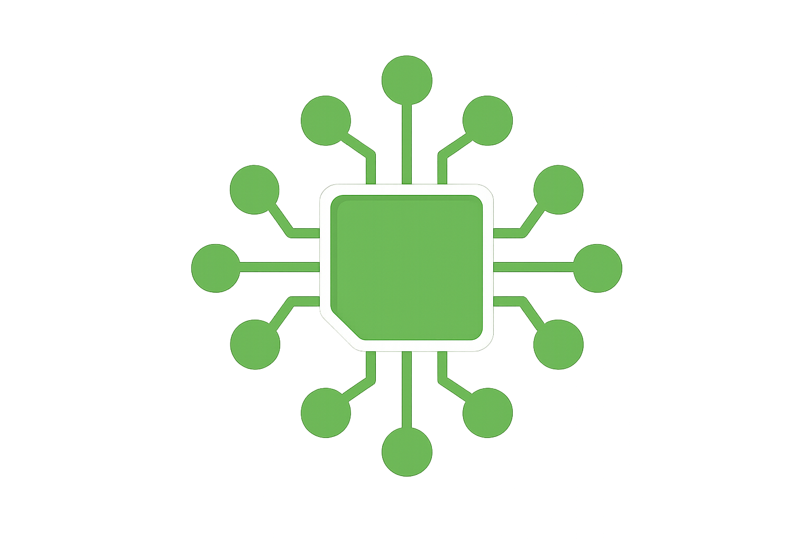
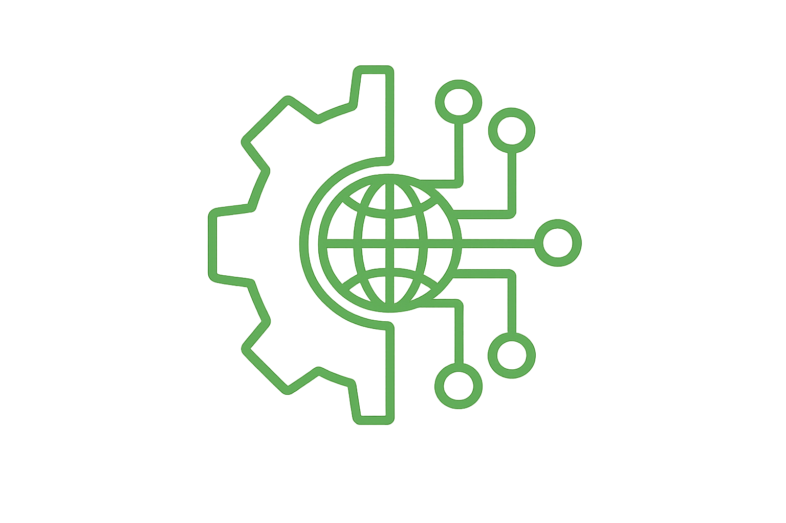
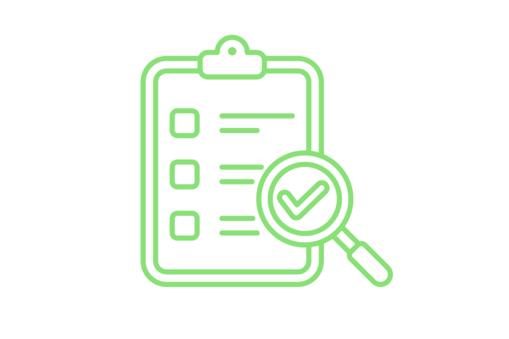
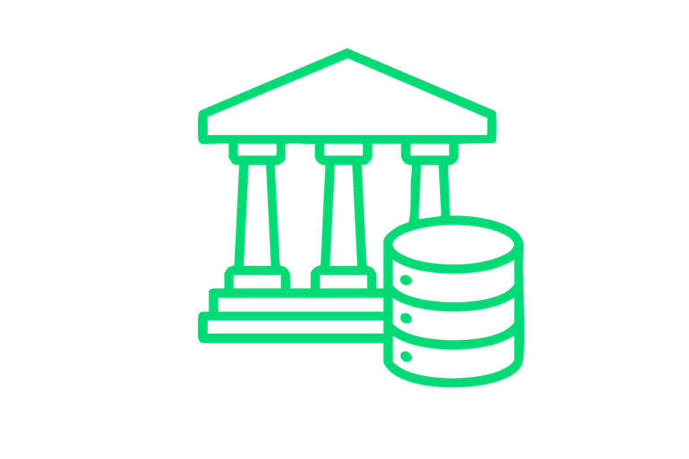
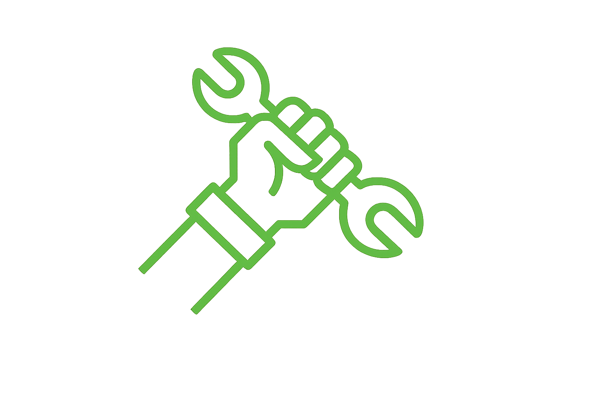

---
hide:
  - toc
---

<h1 id="seus-dados-de-projeto-existem-eles-so-nao-conversam-entre-si">Seus dados de projeto existem. Eles só não conversam entre si.</h1>

A Brasidata conecta IFC, documentos, fotos, planilhas, pedidos e notas fiscais e registros de execução em uma base única e consultável — e coloca uma camada de IA em cima dela, para você perguntar em linguagem natural o que precisa saber sobre a obra. Por trás está o InfoBIM, nosso motor de código aberto. Você recebe a base consultável, um dossiê navegável em HTML e um relatório de lacunas, em dias, não semanas.

[Fale com a gente](https://api.whatsapp.com/send/?phone=5524981796934&text=Ol%C3%A1%2C+vim+do+site+e+quero+saber+mais%21%20-%20%5BHero%5D&type=phone_number&app_absent=0){ .md-button .md-button--primary }
[Como funciona](#how-it-works){ .md-button }

ENGENHARIA DE INFORMAÇÃO

## O que fazemos

A informação da sua obra já está toda lá — espalhada entre modelos, contratos, planilhas, fotos de campo e conversas. O trabalho é conectar essas fontes umas às outras e transformar isso em algo que responde perguntas.

-   ### Conexão transversal de fontes
    
    IFC, documentos contratuais, fotos de campo, planilhas, pedidos e notas fiscais e registros de execução, ligados entre si em uma base única. O elemento do modelo passa a saber qual nota fiscal o comprou e qual foto registrou sua execução.

-   ### Consulta em linguagem natural
    
    Uma camada de IA sobre a base conectada. Você pergunta quantitativos, materiais, prazos, status de um sistema ou o histórico de uma decisão, e recebe a resposta direto — sem abrir software pesado nem garimpar pasta de rede.

-   ### Rastreabilidade até a fonte
    
    Toda resposta aponta de volta para o arquivo, a página ou a foto que a originou. Você não precisa confiar no resumo: pode conferir de onde cada informação veio.

-   ### Motor de código aberto, sem lock-in
    
    O InfoBIM é open-source. Você pode auditar como a informação foi conectada e levar seus dados para onde quiser — é prova de competência técnica, não uma dependência de fornecedor.

Trabalhamos com escopo fechado, definido caso a caso, e entrega em dias. Não é assinatura de autoatendimento: conversamos antes para entender o cenário.

[Fale com a gente sobre o seu projeto](https://api.whatsapp.com/send/?phone=5524981796934&text=Ol%C3%A1%2C+vim+do+site+e+quero+saber+mais%21%20-%20%5BComoFunciona%5D&type=phone_number&app_absent=0){ .md-button .md-button--primary }

QUANDO CHAMAR A BRASIDATA

## Quando esse trabalho faz diferença

Não é um serviço de rotina. É acionado quando a informação de um ativo, sistema ou etapa precisa ser reunida e consultável em pouco tempo.

-   ### Handover, as-built e comissionamento
    
    Quando a entrega não fecha porque falta amarração entre o que foi projetado, o que foi executado e o que foi documentado.

-   ### Medição, auditoria técnica e fiscalização
    
    Quando é preciso reconstruir o histórico de uma medição a partir das fontes, e não apenas de uma planilha consolidada.

-   ### Investigação de causa-raiz
    
    Quando aparece uma não conformidade crítica e é preciso cruzar projeto, execução e decisões para entender a origem.

-   ### Retomada de obra ou troca de equipe
    
    Quando uma nova equipe assume um projeto e precisa recuperar o contexto técnico antes de seguir.

-   ### Sustentação técnica de pleito contratual
    
    Quando um pleito ou uma revisão de contrato precisa ser sustentado com dado de engenharia rastreável até a fonte.

[Reconheço esse cenário — fale com a gente](https://api.whatsapp.com/send/?phone=5524981796934&text=Ol%C3%A1%2C+vim+do+site+e+quero+saber+mais%21%20-%20%5BGatilhos%5D&type=phone_number&app_absent=0){ .md-button .md-button--primary }

## Para quem trabalhamos

Atuamos onde o volume de informação é grande e disperso o suficiente para que ninguém consiga responder rápido a uma pergunta técnica — não é o perfil de pequenas construtoras residenciais.

-   ### EPC industrial, óleo & gás e data centers
    
    Projetos de alta complexidade, muitos contratados e alto custo de retrabalho, onde uma informação perdida custa caro.

-   ### Infraestrutura, concessões e obras públicas complexas
    
    Contratos longos, fiscalização recorrente e exigência de documentação organizada e recuperável.

-   ### Perícia, comissionamento/handover e gerenciadoras
    
    Também são canais parceiros: operamos por trás da marca de quem já presta esse serviço ao cliente final.

-   ### Proprietários e operadores de ativos industriais críticos
    
    Quem responde pela operação e manutenção depois da entrega, e precisa achar qualquer manual, medida ou registro em segundos.

[Meu caso se encaixa — fale com a gente](https://api.whatsapp.com/send/?phone=5524981796934&text=Ol%C3%A1%2C+vim+do+site+e+quero+saber+mais%21%20-%20%5BSegmentos%5D&type=phone_number&app_absent=0){ .md-button .md-button--primary }

OFERTAS RECORRENTES

## Depois do trabalho pontual, mantemos a base viva

Ofertas complementares — para quem já contratou um trabalho pontual ou já tem relação com a Brasidata. Não são o nosso produto principal.

-   ### Parceria White-Label
    Operamos o InfoBIM por trás dos panos e entregamos as bases consultáveis e os dossiês com a marca do seu escritório de perícia, consultoria de comissionamento ou gerenciadora. Você mantém a responsabilidade técnica e o laudo; a Brasidata é fornecedora de apoio à análise. Assinatura mensal + taxa por projeto.

-   ### Manutenção Contínua
    Para quem já contratou um trabalho pontual: mantemos a base conectada e atualizada ao longo da obra ou da operação, em vez de deixá-la envelhecer. Assinatura mensal.

-   ### InfoBIM Watch
    Monitoramento passivo e de baixo custo, para quem já teve contato com a Brasidata. Não é vendido por prospecção fria.

[Fale com a gente sobre essas opções](https://api.whatsapp.com/send/?phone=5524981796934&text=Ol%C3%A1%2C+vim+do+site+e+quero+saber+mais%21%20-%20%5BOfertas%5D&type=phone_number&app_absent=0){ .md-button .md-button--primary }

## Perguntas Frequentes

O que exatamente vocês entregam?

Uma base única e consultável com os dados do seu projeto conectados entre si, um dossiê navegável em HTML e um relatório de lacunas apontando o que está faltando ou inconsistente nas fontes.

Como funciona a consulta em linguagem natural?

Colocamos uma camada de IA sobre a base conectada. Em vez de abrir o modelo e garimpar pasta de rede, você pergunta em português — quantitativos, materiais, prazos, status de um sistema, histórico de uma decisão — e recebe a resposta com o caminho de volta até o arquivo que a originou.

Eu já uso BIM e Revit. Por que preciso da Brasidata?

O BIM modela a geometria. Nós conectamos esse modelo ao resto: contratos, notas fiscais, fotos de campo, planilhas e registros de execução — e tornamos esse conjunto consultável.

Isso é um software que eu assino?

Não. Não é um SaaS de autoatendimento. É um trabalho de engenharia com escopo fechado por projeto — conversamos primeiro para entender o cenário antes de qualquer proposta.

O que é o InfoBIM?

É o motor de código aberto que a Brasidata usa como infraestrutura interna para conectar as fontes. Por ser aberto, você pode auditar como a informação foi ligada e não fica preso a nós.

Quanto tempo leva?

Dias, não semanas. O prazo exato depende do volume e da dispersão das fontes envolvidas.

Quanto custa?

Preço por escopo fechado, definido caso a caso. Não trabalhamos com tabela pública — fale com a gente para entender o seu cenário.

Dá para integrar informação de WhatsApp e planilhas?

Sim. Fontes informais entram no mesmo trabalho: conversas, documentos e planilhas são vinculados ao contexto técnico da obra para que nada fique solto.

Meus dados ficam presos à Brasidata?

Não. O InfoBIM é open-source, então você tem acesso e portabilidade garantidos, sem depender de um único fornecedor.

## Pare de procurar informação que sua empresa já tem

Se responder uma pergunta técnica simples sobre a sua obra hoje leva dias, o problema não é falta de dado — é falta de conexão entre eles.

[Fale com a gente](https://api.whatsapp.com/send/?phone=5524981796934&text=Ol%C3%A1%2C+vim+do+site+e+quero+saber+mais%21%20-%20%5BCTA%20Final%5D&type=phone_number&app_absent=0){ .md-button .md-button--primary }

